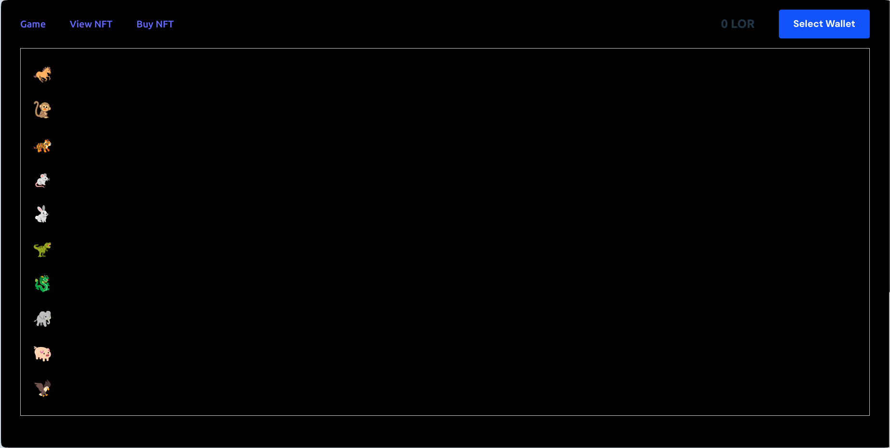
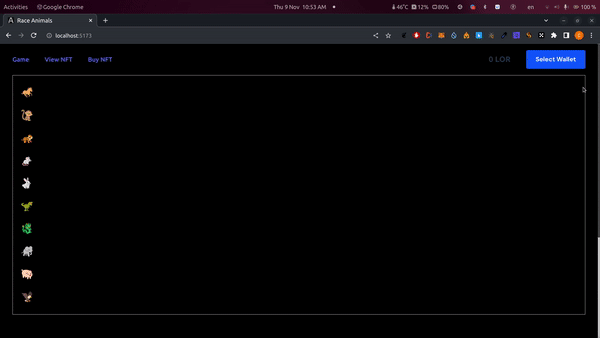
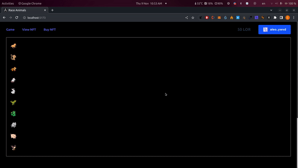
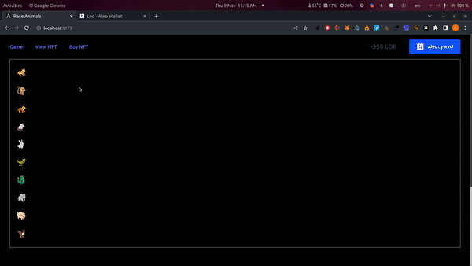
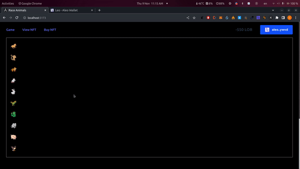

# Aleo Animal Racing
                    ╔══╗╔╗─╔╗╔══╗╔╗──╔╗╔══╗╔╗──
                    ║╔╗║║╚═╝║╚╗╔╝║║──║║║╔╗║║║──
                    ║╚╝║║╔╗─║─║║─║╚╗╔╝║║╚╝║║║──
                    ║╔╗║║║╚╗║─║║─║╔╗╔╗║║╔╗║║║──
                    ║║║║║║─║║╔╝╚╗║║╚╝║║║║║║║╚═╗
                    ╚╝╚╝╚╝─╚╝╚══╝╚╝──╚╝╚╝╚╝╚══╝

                    ╔═══╗╔══╗╔══╗╔══╗╔╗─╔╗╔═══╗
                    ║╔═╗║║╔╗║║╔═╝╚╗╔╝║╚═╝║║╔══╝
                    ║╚═╝║║╚╝║║║───║║─║╔╗─║║║╔═╗
                    ║╔╗╔╝║╔╗║║║───║║─║║╚╗║║║╚╗║
                    ║║║║─║║║║║╚═╗╔╝╚╗║║─║║║╚═╝║
                    ╚╝╚╝─╚╝╚╝╚══╝╚══╝╚╝─╚╝╚═══╝

                    


## Getting started
### Members
- [Chien179](https://github.com/Chien179)
- [nltruong](https://github.com/nltruonq)

1. Clone the source code from the repository:

```bash
git clone https://github.com/devkupro/AleoAnimalRacing.git
```
2. Use Makefile to run
- Server:
    - install package
    ```bash
    npm install
    ```
    - run server by CLI
    ```bash
    npm start
    ```
- UI:
    - install package
    ```bash
    npm install
    ```
    - run UI by CLI
    ```bash
    npm run dev
    ```

## Descriptions:
1. Mint Token
- Mint token on Aleo's blockchain
  

         
2. Game Betting
- Betting for animal racing
  


3. Marketplace NFT
- Buy NFT


- View NFT
